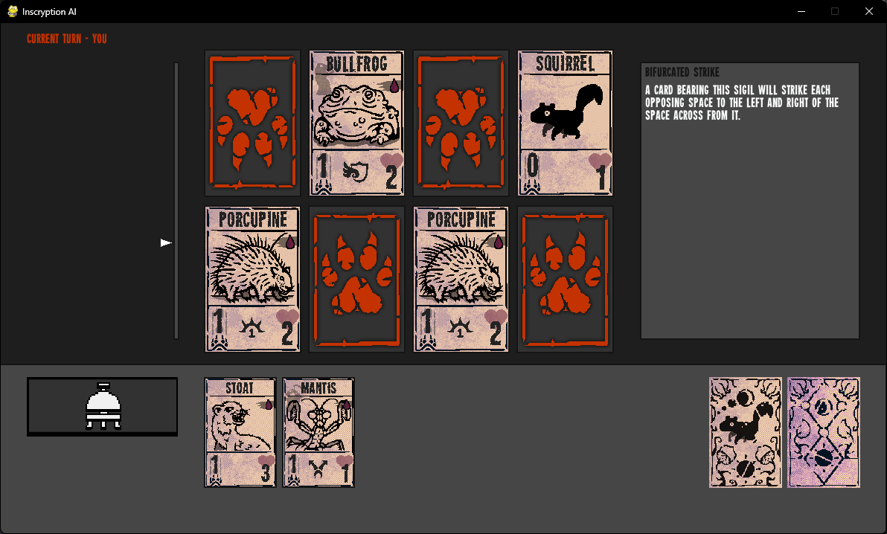

# Inscryption-Adaptive-AI

*A Python / PyGame strategy game with an adaptive Monte Carlo Tree Search (MCTS) opponent.*



---

## Features
- **Adaptive AI** – difficulty scales to your recent play efficiency  
- **Optimised MCTS** – bitboards, memoisation, 4‑process root parallelism  
- **Move Visualiser** – optional overlay shows *best* and *worst* moves after each turn  
- Full **GUI in PyGame** – health scale, hand management, right‑click sigil info  
- **One‑click Windows build** – `build_exe.bat` creates a standalone `.exe`

---

## Quick Start

```bash
git clone https://github.com/michael-y03/Inscryption-Adaptive-AI.git
cd adaptive-ai-game
python -m venv .venv && source .venv/bin/activate     # Windows: .venv\Scripts\activate
pip install -r requirements.txt
python -m src.main
